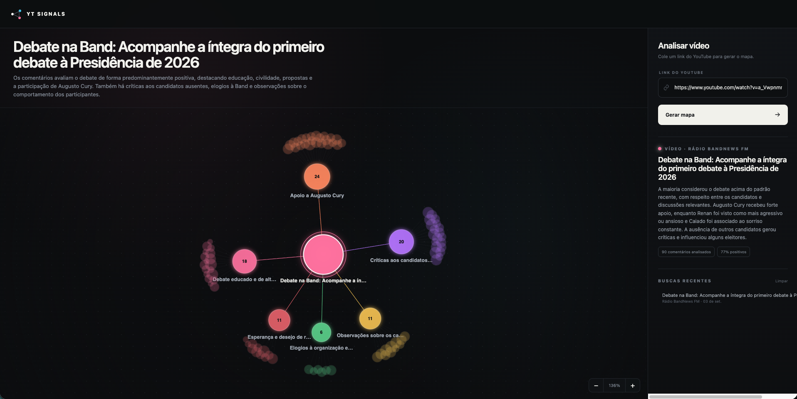

<div align="center">

# YT Signals

### Transforme comentários do YouTube em decisões claras.

O YT Signals lê a conversa da audiência, identifica temas e sentimentos com IA e organiza tudo em um mapa visual interativo — sem planilhas, amostragens manuais ou horas navegando pela seção de comentários.


</div>

## Veja o YT Signals em ação

<p align="center">
  <a href="docs/screenshots/yt-signals-map.png">
    
  </a>
</p>

<p align="center"><sub>Uma análise completa transforma comentários dispersos em temas conectados, sentimento e evidências exploráveis.</sub></p>

<!--
Screenshots opcionais para complementar a apresentação:


-->

## Entenda sua audiência de verdade

Cole o link de um vídeo e receba uma leitura estruturada dos comentários mais relevantes. O YT Signals transforma uma conversa dispersa em sinais fáceis de explorar:

- temas que mais mobilizam a audiência;
- sentimento positivo, neutro e negativo;
- comentários que sustentam cada conclusão;
- palavras-chave e oportunidades recorrentes;
- resumo executivo e principais aprendizados;
- histórico local para revisitar análises anteriores.

Cada comentário analisado aparece em apenas um tema principal. Isso mantém as contagens coerentes e permite sair do resumo agregado para a evidência original com um clique.

## Uma interface feita para exploração

O mapa representa visualmente a conversa do público. Temas mais relevantes ganham destaque, enquanto os comentários permanecem conectados ao contexto que lhes deu significado.

Você pode navegar, ampliar, arrastar e selecionar os nós para descobrir rapidamente o que as pessoas elogiam, questionam, criticam ou querem ver a seguir.

## Como funciona

```text
Link do vídeo
     ↓
YouTube Data API ── metadados + comentários públicos
     ↓
OpenAI Responses API ── temas + sentimento + aprendizados
     ↓
Validação e reconstrução segura dos comentários
     ↓
Mapa interativo + histórico local
```

Frontend e backend fazem parte da mesma aplicação e usam um único `package.json`:

- no desenvolvimento, Vite serve a interface e a API na porta `5173`;
- em produção, Node serve o build e a API na porta configurada, por padrão `8080`;
- as chaves do YouTube e da OpenAI permanecem exclusivamente no servidor;
- respostas externas são validadas antes de chegar ao grafo.

## Tecnologias

- React 19 e TypeScript;
- Node.js com servidor HTTP nativo;
- Vite;
- YouTube Data API v3;
- OpenAI Responses API com Structured Outputs;
- Zod para validação de contratos;
- React Force Graph para a visualização;
- Vitest e Testing Library.

## Execute localmente

### Pré-requisitos

- Node.js 20 ou superior;
- uma chave da YouTube Data API v3;
- uma chave da OpenAI API.

### 1. Instale as dependências

```bash
npm install
```

### 2. Configure o ambiente

```bash
cp .env.example .env
```

Preencha pelo menos estas duas variáveis:

```dotenv
YOUTUBE_API_KEY=your_youtube_data_api_key
OPENAI_API_KEY=your_openai_api_key
```

Configurações disponíveis:

| Variável | Padrão | Descrição |
| --- | --- | --- |
| `HTTP_ADDRESS` | `127.0.0.1:8080` | Endereço usado pelo servidor de produção |
| `YOUTUBE_API_KEY` | — | Chave da YouTube Data API v3 |
| `OPENAI_API_KEY` | — | Chave da OpenAI API |
| `OPENAI_MODEL` | `gpt-5.6-luna` | Modelo usado para analisar os comentários |
| `OPENAI_REASONING_EFFORT` | `low` | Esforço de raciocínio enviado ao modelo |
| `OPENAI_TIMEOUT` | `2m30s` | Limite de tempo de cada chamada à OpenAI |
| `DEBUG_PAYLOAD_LOGS` | `false` | Exibe payloads completos para depuração local |

Não ative `DEBUG_PAYLOAD_LOGS` em produção: os logs podem conter nomes e textos públicos dos comentários analisados.

### 3. Inicie o desenvolvimento

```bash
npm run dev
```

Acesse [http://127.0.0.1:5173](http://127.0.0.1:5173). Frontend e backend estarão disponíveis nessa mesma porta.

## Execute em produção

```bash
npm run build
npm start
```

A aplicação será disponibilizada em [http://127.0.0.1:8080](http://127.0.0.1:8080), salvo quando `HTTP_ADDRESS`, `HTTP_HOST` ou `PORT` definirem outro endereço.

O processo Node serve simultaneamente:

- o frontend compilado em `dist`;
- `GET /health`;
- `POST /api/v1/videos/{videoId}/comment-analysis`.

## Testes e qualidade

```bash
npm run check
npm run build
```

A suíte cobre frontend, cliente do YouTube, análise da OpenAI, validações de domínio, endpoint HTTP e o pipeline completo com serviços externos falsos. Os testes automatizados não consomem as chaves do `.env`.

## Limites atuais

- um vídeo por análise;
- até 100 comentários relevantes por mapa;
- somente comentários públicos de nível principal;
- uma análise pode levar alguns minutos, dependendo do vídeo e do modelo.
